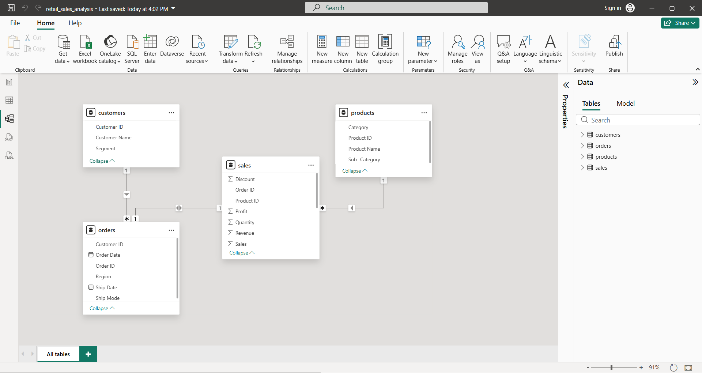
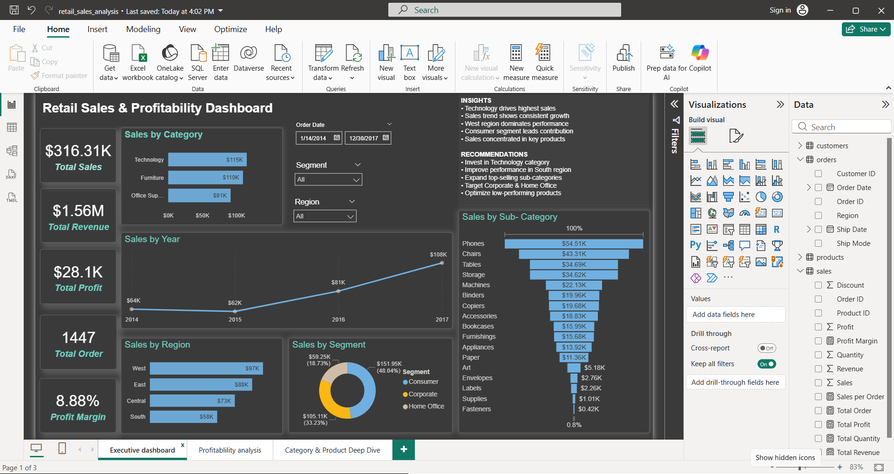
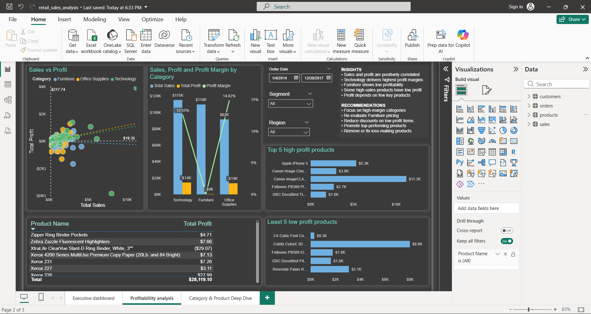
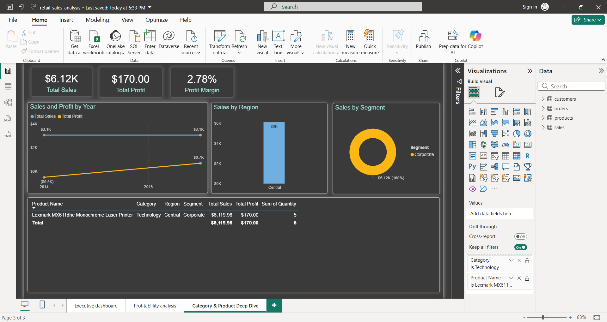

# 📊 Retail Sales Analysis Dashboard

## 📌 Project Overview

This project analyzes retail sales data to uncover key business insights related to **revenue, profit, product performance, and regional trends**. The analysis was performed using **MySQL for data querying** and **Power BI for visualization** enabling data-driven decision-making.

---

## 🎯 Business Objective

* Analyze sales and profit trends over time
* Identify high-performing and low-performing products
* Evaluate category-wise and regional performance
* Provide actionable insights to improve profitability

---

## 🛠 Tools & Technologies Used

* **MySQL** – Data extraction and analysis
* **Power BI** – Data Modeling and Dashboard creation 
* **DAX** – KPI calculations
* **ODBC Connector** – Data connectivity

---

## 🗂 Dataset Details

The dataset includes:

* Order Date, Region, Segment
* Product Category & Sub-Category
* Sales, Profit, Quantity
* Customer Information

---

## 🔷 Data Processing (MySQL)

### ✅ Data Cleaning

* Checked for null values 
* Standardized column formats
* Handled date conversions

### ✅ SQL Analysis

Created fact and dimension tables using **STAR Schema**.
Some key SQL queries used:

```sql
-- Total Sales
SELECT SUM(sales) AS total_sales FROM sales;

#Data Validation - Joins
SELECT o.order_id,
o.region,
c.customer_name,
p.product_name,
s.sales,
s.profit
FROM sales s
JOIN orders o ON s.order_id = o.order_id
JOIN customers c ON o.customer_id = c.customer_id
JOIN products p ON s.product_id = p.product_id
LIMIT 10;

#sales by region
SELECT o.region,
SUM(s.sales) AS total_sales
FROM sales s
JOIN orders o ON s.order_id = o.order_id
GROUP BY o.region;

#profit by category
SELECT p.category,
SUM(s.profit) AS total_profit
FROM sales s
JOIN products p ON s.product_id = p.product_id
GROUP BY p.category;

-- sales by month and year
SELECT 
YEAR(o.order_date) AS year,
MONTH(o.order_date) AS month,
SUM(s.sales) AS total_sales
FROM sales s 
JOIN orders o ON s.order_id = o.order_id
GROUP BY year,month
ORDER BY year,month;
```

---

## 🔷 Data Connection

The MySQL database was connected to Power BI using an **ODBC connector**:

* Installed MySQL ODBC driver
* Configured DSN connection
* Imported tables into Power BI

---

## 🔷 Data Modeling (Power BI)

* Established relationships between:

  * Orders
  * Sales
  * Products
  * Customers

---

## 🔷 DAX Measures

```DAX
Total Sales = SUM(sales[Sales])

Total Profit = SUM(sales[Profit])

Profit Margin = DIVIDE([Total Profit], [Total Sales])

Sales per Order = DIVIDE([Total Sales], DISTINCTCOUNT(orders[Order ID]))

---

## 🔷 Dashboard Features

### 📊 Executive Dashboard

* KPI Cards:

  * Total Sales
  * Total Revenue
  * Total Profit
  * Total Orders
  * Profit Margin

* Visualizations:

  * Sales by Category
  * Sales by Region
  * Sales by Segment
  * Sales by Sub-category
  * Year-wise Sales Trend

---

### 📊 Profitability Analysis

* Profit by Category
* Sales by Category
* Profit Margin insights

---

### 📊 Category & Product Deep Dive

* Drill-through functionality
* Product-level analysis
* Category performance

---

## 🔷 Key Insights

* **Technology** category generates the **highest sales**
* **West** region shows **strongest performance**
* Sales trend indicates steady growth over the years
* **Consumer** segment contributes the **largest share**
* Some sub-categories have high sales but low profitability

---

## 🔷 Business Recommendations

* Focus on **high-margin products** to improve profitability
* Review pricing strategy for low-profit products
* Optimize inventory for top-performing categories
* Reduce losses from underperforming products
* Target high-performing regions for expansion

---

## 🔷 Challenges Faced

* Managing relationships across multiple tables
* Ensuring dynamic DAX calculations

---

## 🔷 Project Outcome

Successfully developed an interactive dashboard that:

* Tracks sales and profit performance
* Enables dynamic filtering and drill-down
* Provides actionable business insights

---

## 📸 Dashboard Preview

### Data Modeling



### Executive Dashboard



### Profitability Analysis



### Category and Product Deep Dive



---

## 📁 Project Structure

```
Retail-Sales-Analysis/
│
├── Dataset/
├── SQL/
├── PowerBI/
├── Screenshots/
└── README.md
```

---

## 🔗 Project Files

* Dataset
* SQL Queries
* Power BI Dashboard (.pbix)
* Screenshots

---

## 🔷 How to Use

1. Clone the repository
2. Open `.pbix` file in Power BI Desktop
3. Ensure ODBC connection is configured
4. Refresh data if needed

---

## 📌 Key Skills Demonstrated

* Data Analysis (SQL)
* Data Visualization (Power BI)
* KPI Development
* Business Insight Generation
* Dashboard Design

---

## 📬 Conclusion

This project demonstrates how retail data can be transformed into actionable insights to **increase revenue, improve profit margins, and optimize product strategy**.

---

## 🔗 Author

**Gowsalya Kannadhasan**
LinkedIn: www.linkedin.com/in/gowsalya-kannadhasan-0a7017139
GitHub: https://github.com/GowsalyaKannan
